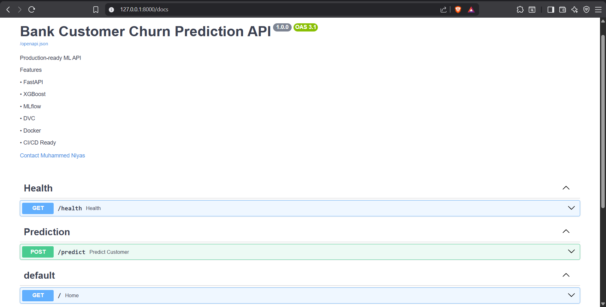
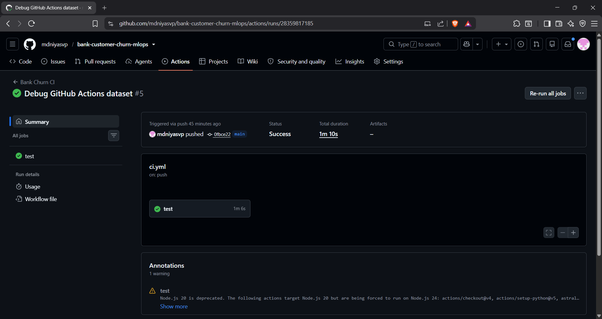

# 🚀 Bank Customer Churn Prediction MLOps


An end-to-end Machine Learning Operations (MLOps) project for predicting customer churn using **XGBoost**, **FastAPI**, **Docker**, **MLflow**, **GitHub Actions**, and **UV**.

The project demonstrates the complete lifecycle of an ML application—from data preprocessing and model training to experiment tracking, API deployment, containerization, automated testing, and continuous integration.

---

## 📌 Project Highlights

- End-to-End MLOps Pipeline
- XGBoost Classification Model
- Hyperparameter Tuning
- MLflow Experiment Tracking & Model Registry
- FastAPI REST API
- Dockerized Deployment
- Automated Testing with Pytest
- GitHub Actions CI Pipeline
- Modular Production-Ready Project Structure

---

## 🛠 Tech Stack

| Category | Technologies |
|----------|--------------|
| Language | Python 3.13 |
| ML | Scikit-Learn, XGBoost |
| API | FastAPI, Uvicorn |
| Experiment Tracking | MLflow |
| Testing | Pytest |
| Containerization | Docker |
| CI/CD | GitHub Actions |
| Environment | UV |
| Version Control | Git & GitHub |

---

## 🏗 Project Architecture

```text
                Dataset
                   │
                   ▼
           Data Preprocessing
                   │
                   ▼
          Feature Engineering
                   │
                   ▼
        Hyperparameter Tuning
                   │
                   ▼
            XGBoost Training
                   │
                   ▼
        MLflow Experiment Tracking
                   │
                   ▼
         Saved Model (.joblib)
                   │
                   ▼
            FastAPI REST API
                   │
                   ▼
          Docker Container
                   │
                   ▼
       GitHub Actions CI Pipeline
```

---

## ✨ Features

- Customer churn prediction using XGBoost
- Modular project structure
- Configurable training pipeline
- MLflow experiment tracking
- Model versioning
- REST API with FastAPI
- Input validation using Pydantic
- Dockerized deployment
- Health check endpoint
- Automated API testing
- Continuous Integration using GitHub Actions

---

## 📂 Project Structure

```text
bank-customer-churn-mlops/
│
├── api/
├── data/
│   └── raw/
├── models/
├── reports/
├── src/
│   ├── config/
│   ├── data/
│   ├── models/
│   └── utils/
│
├── tests/
├── .github/workflows/
├── Dockerfile
├── pyproject.toml
├── uv.lock
└── README.md
```

---

## 📈 Model Performance

| Metric | Score |
|---------|------:|
| Accuracy | 0.8649 |
| Precision | 0.7405 |
| Recall | 0.5566 |
| F1 Score | 0.6355 |
| ROC-AUC | 0.8886 |

---

## 🌐 API Endpoints

| Endpoint | Method | Description |
|-----------|--------|-------------|
| / | GET | Welcome endpoint |
| /health | GET | Health check |
| /predict | POST | Customer churn prediction |

Swagger Documentation:

```
http://localhost:8000/docs
```

---

## ✅ Testing

Run all tests:

```bash
uv run pytest -v
```

Current Tests

- Health Endpoint
- Prediction Endpoint
- Invalid Input Validation

---

## 🐳 Docker

Build Image

```bash
docker build -t bank-churn-api .
```

Run Container

```bash
docker run -p 8000:8000 bank-churn-api
```

---

## ⚙ GitHub Actions

The CI pipeline automatically:

- Installs dependencies
- Trains the model
- Runs automated tests
- Builds the Docker image

The workflow executes on every push and pull request.

---

## 🚀 Future Improvements

- Cloud Deployment (Render/AWS)
- Model Monitoring
- Data Drift Detection
- Automated Retraining
- Kubernetes Deployment
- Model Registry Promotion Workflow

---

## 👨‍💻 Author

**Muhammed Niyas V P**

- GitHub: https://github.com/mdniyasvp
- LinkedIn: *(https://www.linkedin.com/in/muhammedniyasvp)*

---

## 📸 Project Screenshots

### Swagger UI



---

### MLflow Experiment Tracking


---

### GitHub Actions CI



---

### Dockerized API


