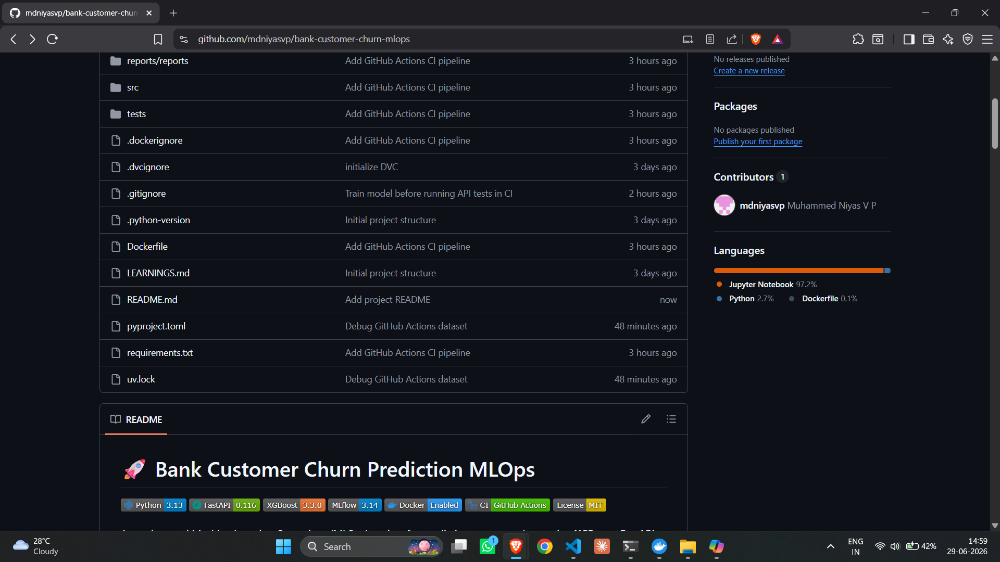
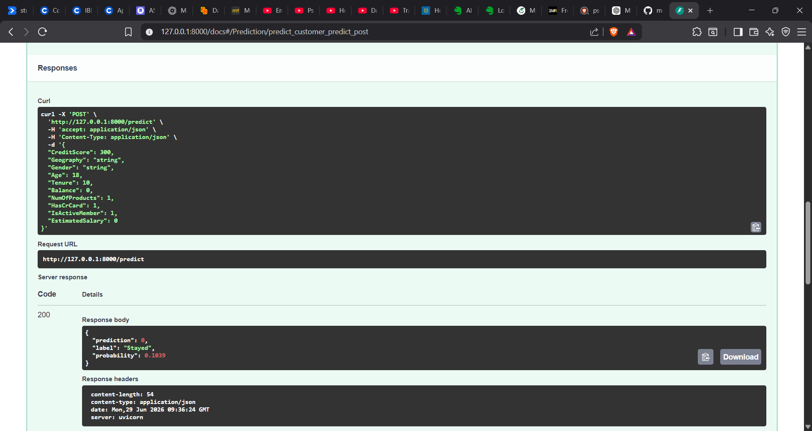
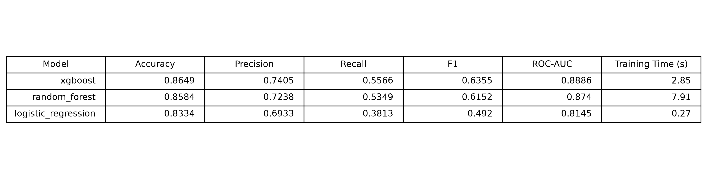

# 🏦 Bank Customer Churn Prediction MLOps Pipeline

<p align="center">


</p>

---

## 📌 Project Overview

This project is an **end-to-end Machine Learning Operations (MLOps) pipeline** for predicting whether a bank customer is likely to leave the bank (customer churn).

The project demonstrates the complete lifecycle of a production-ready machine learning system—from data preprocessing and model training to experiment tracking, model comparison, API development, containerization, CI automation, and cloud deployment.

Unlike a simple machine learning notebook, this project follows software engineering best practices by integrating:

- Data Versioning with **DVC**
- Experiment Tracking with **MLflow**
- Automatic Best Model Selection
- REST API using **FastAPI**
- Docker Containerization
- GitHub Actions Continuous Integration
- Railway Cloud Deployment

The application automatically compares multiple machine learning models and serves predictions using the best-performing model.

---

# 🚀 Live Demo

### 🌐 Railway Deployment

**Base URL**

```
https://bank-customer-churn-mlops-production.up.railway.app
```

### 📚 Swagger Documentation

```
https://bank-customer-churn-mlops-production.up.railway.app/docs
```

### ❤️ Health Check

```
https://bank-customer-churn-mlops-production.up.railway.app/health
```

---

# ✨ Features

- ✅ End-to-End Machine Learning Pipeline
- ✅ Data Versioning using DVC
- ✅ Experiment Tracking with MLflow
- ✅ Logistic Regression Training
- ✅ Random Forest Training
- ✅ XGBoost Training
- ✅ Automatic Best Model Selection
- ✅ Model Serialization with Joblib
- ✅ REST API using FastAPI
- ✅ Request Validation using Pydantic
- ✅ Structured Logging
- ✅ Dockerized Application
- ✅ GitHub Actions CI Pipeline
- ✅ Railway Cloud Deployment
- ✅ Swagger UI Documentation
- ✅ Health Check Endpoint
- ✅ Production-ready Project Structure

---

# 🛠 Tech Stack

| Category | Technologies |
|-----------|--------------|
| Programming | Python 3.13 |
| Machine Learning | Scikit-learn, XGBoost |
| API | FastAPI |
| Validation | Pydantic |
| Experiment Tracking | MLflow |
| Data Versioning | DVC |
| Containerization | Docker |
| Version Control | Git & GitHub |
| CI/CD | GitHub Actions |
| Deployment | Railway |
| Environment Management | uv |
| Model Serialization | Joblib |

---

# 🏗️ Project Architecture

```text
                           Bank Customer Churn Dataset
                                      │
                                      ▼
                           Data Loading & Validation
                                      │
                                      ▼
                             Data Preprocessing
                    (Encoding, Cleaning, Feature Selection)
                                      │
                                      ▼
                          Train Multiple ML Models
        ┌─────────────────────┬──────────────────────┬
        │                     │                      │
        ▼                     ▼                      ▼
 Logistic Regression     Random Forest           XGBoost
        │                     │                      │
        └───────────────Evaluate & Compare───────────┘
                              │
                              ▼
                  Automatic Best Model Selection
                              │
                              ▼
                 Save Best Model (Joblib Format)
                              │
                              ▼
                      Track Experiments (MLflow)
                              │
                              ▼
                 Serve Predictions using FastAPI
                              │
                              ▼
                      Docker Containerization
                              │
                              ▼
                  GitHub Actions Continuous Integration
                              │
                              ▼
                   Railway Cloud Deployment
```

---

# 📂 Project Structure

```text
bank-customer-churn-mlops
│
├── .github/
│   └── workflows/
│       └── ci.yml
│
├── api/
│   ├── routers/
│   ├── utils/
│   ├── predictor.py
│   ├── schemas.py
│   └── main.py
│
├── data/
│   ├── raw/
│   └── processed/
│
├── models/
│   └── xgboost.joblib
│
├── notebooks/
│
├── reports/
│   ├── model_comparison.csv
│   ├── model_comparison.md
│   └── model_comparison.png
│
├── src/
│   ├── config/
│   ├── data/
│   ├── models/
│   ├── pipelines/
│   └── utils/
│
├── tests/
│
├── Dockerfile
├── pyproject.toml
├── uv.lock
├── README.md
└── .gitignore
```

---

# 🔄 Machine Learning Pipeline

The machine learning workflow is fully modular and reproducible.

## 1️⃣ Data Loading

- Reads the customer churn dataset
- Validates dataset availability
- Loads data using Pandas

---

## 2️⃣ Data Preprocessing

The preprocessing pipeline performs:

- Removal of unnecessary columns
- Encoding of categorical variables
- Feature preparation
- Train/Test split

---

## 3️⃣ Model Training

The pipeline trains three different machine learning algorithms.

| Model | Purpose |
|--------|----------|
| Logistic Regression | Baseline linear classifier |
| Random Forest | Ensemble learning model |
| XGBoost | Gradient boosting model |

Each model is trained independently using the same preprocessing pipeline to ensure a fair comparison.

---

## 4️⃣ Model Evaluation

Each trained model is evaluated using multiple classification metrics.

Metrics include:

- Accuracy
- Precision
- Recall
- F1 Score
- ROC-AUC Score
- Confusion Matrix
- Classification Report

---

## 5️⃣ Automatic Best Model Selection

Instead of manually choosing a model, the training pipeline automatically selects the best-performing model using the **F1 Score**.

The selected model is:

- Saved as a Joblib artifact
- Logged to MLflow
- Used by the prediction API

---

# 📊 Model Comparison

The training pipeline automatically generates a comparison report for all trained models.

Generated artifacts:

```text
reports/
│
├── model_comparison.csv
├── model_comparison.md
└── model_comparison.png
```

Example comparison:

| Model | Accuracy | Precision | Recall | F1 Score | ROC-AUC |
|--------|----------|-----------|---------|----------|----------|
| Logistic Regression | ... | ... | ... | ... | ... |
| Random Forest | ... | ... | ... | ... | ... |
| XGBoost | **Best** | **Best** | **Best** | **Best** | **Best** |

---

# 📈 Experiment Tracking with MLflow

Every model training run is automatically logged to MLflow.

Tracked information includes:

- Model Name
- Parameters
- Evaluation Metrics
- Model Artifact
- Training Time

This makes experiments reproducible and simplifies model comparison.

### MLflow Features

- ✅ Experiment Tracking
- ✅ Parameter Logging
- ✅ Metric Logging
- ✅ Model Artifacts
- ✅ Run History

---

# 📦 Data Versioning using DVC

The dataset is version-controlled using **Data Version Control (DVC)**.

Benefits include:

- Versioned datasets
- Reproducible training
- Separation of code and large data files
- Easy synchronization of datasets across environments

DVC ensures that the correct dataset version is always used during model training.

---

# 🌐 REST API

The trained model is served through a **FastAPI** application, providing a lightweight and production-ready REST API.

## Available Endpoints

| Method | Endpoint | Description |
|---------|----------|-------------|
| GET | `/` | Welcome endpoint |
| GET | `/health` | Health check endpoint |
| POST | `/predict` | Predict customer churn |

---

# 📝 API Request Example

## POST `/predict`

### Request Body

```json
{
  "CreditScore": 650,
  "Geography": "France",
  "Gender": "Male",
  "Age": 35,
  "Tenure": 5,
  "Balance": 50000,
  "NumOfProducts": 2,
  "HasCrCard": 1,
  "IsActiveMember": 1,
  "EstimatedSalary": 60000
}
```

### Response

```json
{
  "prediction": 0,
  "label": "Stayed",
  "probability": 0.1832
}
```

---

# 📚 Interactive API Documentation

FastAPI automatically generates interactive API documentation.

### Swagger UI

```
https://bank-customer-churn-mlops-production.up.railway.app/docs
```

Users can:

- Explore all endpoints
- Test API requests
- View request and response schemas
- Validate inputs

---

# 🐳 Docker

The application is fully containerized using Docker.

## Build the Docker Image

```bash
docker build -t bank-churn-api .
```

## Run the Container

```bash
docker run -d \
--name bank-churn-container \
-p 8000:8000 \
bank-churn-api
```

Open Swagger UI:

```
http://localhost:8000/docs
```

---

# ⚙️ GitHub Actions CI

A GitHub Actions workflow automatically validates every push and pull request.

Pipeline steps include:

- Checkout Repository
- Install Python
- Install Dependencies
- Train Machine Learning Model
- Execute Unit Tests
- Build Docker Image

This ensures that only validated code reaches the main branch.

---

# ☁️ Cloud Deployment

The application is deployed on **Railway** using Docker.

### Live Application


- **API:** https://bank-customer-churn-mlops-production.up.railway.app


### API Documentation


- **Swagger UI:** https://bank-customer-churn-mlops-production.up.railway.app/docs


### Health Endpoint


- **Health Check:** https://bank-customer-churn-mlops-production.up.railway.app/health

---

# 🧪 Running Tests

Execute all unit tests using:

```bash
uv run pytest -v
```

Example output:

```text
tests/test_health.py ........ PASSED
tests/test_invalid_input.py . PASSED
tests/test_predict.py ....... PASSED
```

---

# 🚀 Running the Project Locally

Clone the repository:

```bash
git clone https://github.com/mdniyasvp/bank-customer-churn-mlops.git

cd bank-customer-churn-mlops
```

Create a virtual environment:

```bash
uv venv
```

Activate the environment

Windows

```bash
.venv\Scripts\activate
```

Linux / macOS

```bash
source .venv/bin/activate
```

Install dependencies

```bash
uv sync
```

Train the model

```bash
uv run python -m src.models.train
```

Run the API

```bash
uv run uvicorn api.main:app --reload
```

Open

```
http://127.0.0.1:8000/docs
```

---

# 📸 Project Screenshots

## GitHub Repository



---

## GitHub Actions CI


---

## Swagger UI


---

## Prediction Response



---

## Model Comparison



---

# 🔮 Future Improvements

Possible future enhancements include:

- MLflow Model Registry
- Hyperparameter Optimization with Optuna
- Kubernetes Deployment
- AWS / Azure / GCP Deployment
- Model Monitoring
- Data Drift Detection
- Prometheus Metrics
- Grafana Dashboards
- Automated Model Retraining
- Authentication & Authorization
- Batch Prediction Pipeline

---

# 📖 Key Learnings

This project provided hands-on experience with:

- Machine Learning Engineering
- MLOps Best Practices
- Experiment Tracking
- Data Versioning
- REST API Development
- Docker Containerization
- Continuous Integration
- Cloud Deployment
- Software Engineering for ML Systems

---

# 👨‍💻 Author

**Muhammed Niyas V P**

- GitHub: https://github.com/mdniyasvp
- LinkedIn: https://www.linkedin.com/in/muhammedniyasvp

---

## ⭐ Support

If you found this project useful, consider giving it a ⭐ on GitHub.
It helps others discover the project and supports future improvements.

---
