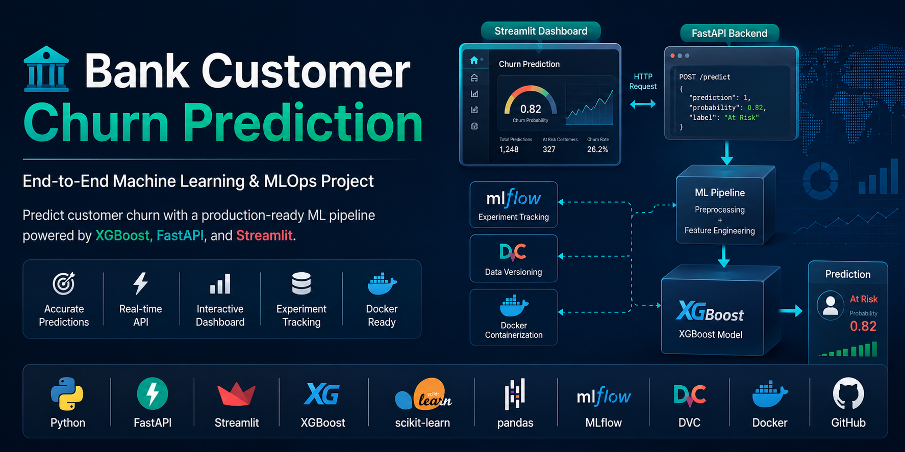
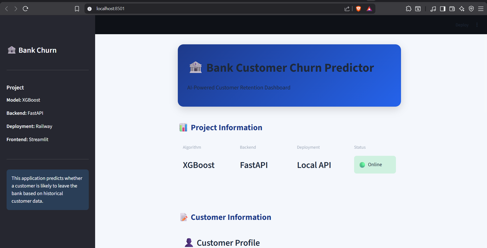
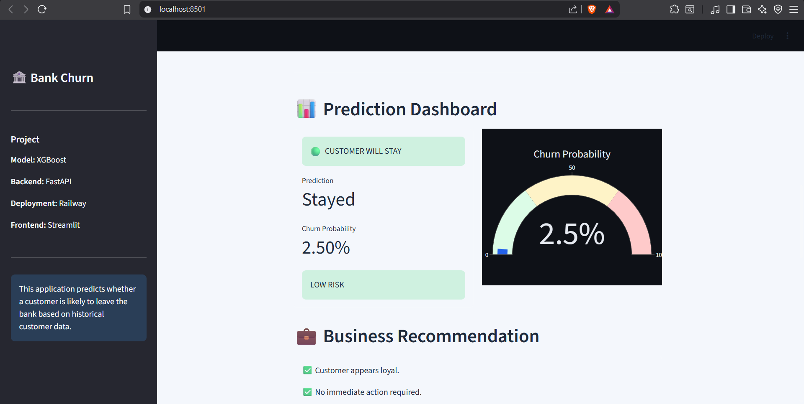
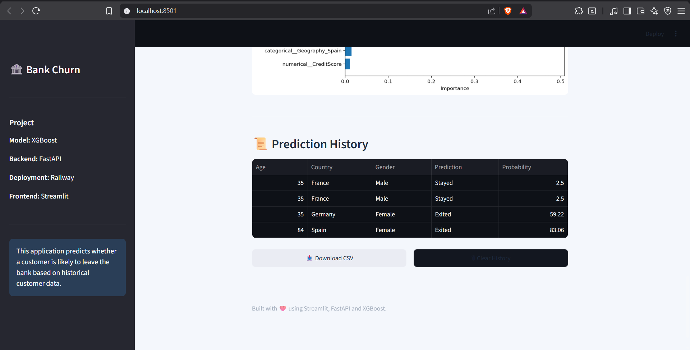
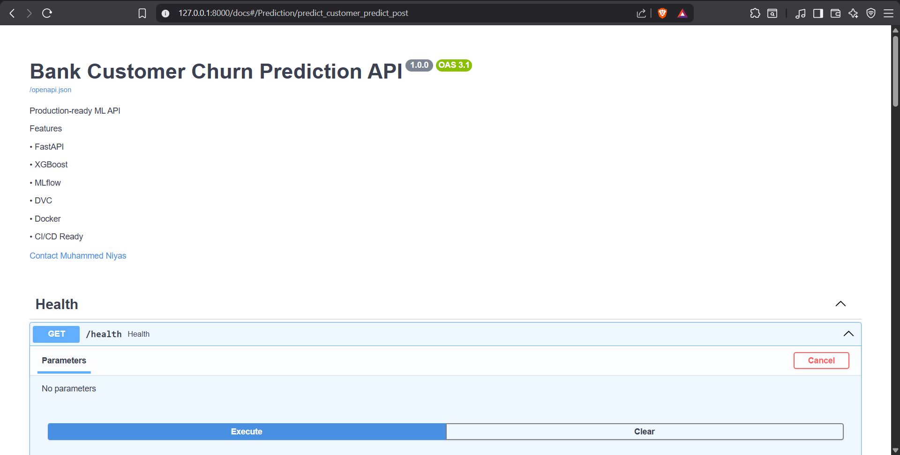
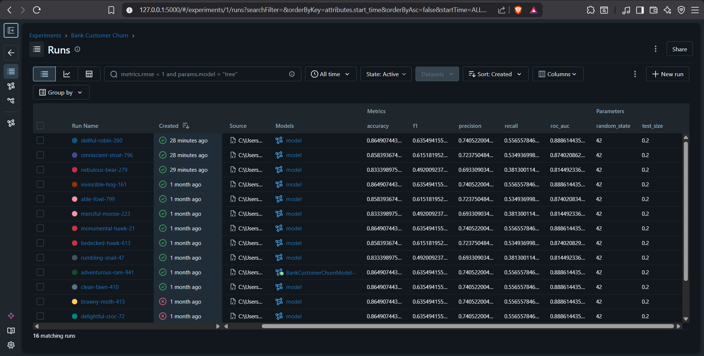

# 🏦 Bank Customer Churn Prediction
<p align="center">
    
</p>

<div align="center">

### Production-Ready Machine Learning & MLOps Application for Customer Churn Prediction

Predict whether a bank customer is likely to leave the bank using a production-ready Machine Learning pipeline built with **XGBoost**, **FastAPI**, and **Streamlit**.

---


</div>

---

## 📌 Overview

This project demonstrates a complete **Machine Learning + MLOps** workflow for predicting customer churn in a banking environment.

The application allows users to enter customer information through an interactive **Streamlit** interface, sends the data to a **FastAPI** backend, and returns a real-time churn prediction using a trained **XGBoost** model.

The project follows a modular architecture and demonstrates production-oriented software engineering practices such as:

- Machine Learning Pipelines
- FastAPI REST APIs
- Streamlit Dashboard
- MLflow Experiment Tracking
- DVC Dataset Versioning
- Docker Containerization
- Modular Project Structure
- Git Version Control

---

## 🚀 Key Features

- 📊 Customer Churn Prediction
- ⚡ FastAPI REST API
- 🎨 Interactive Streamlit Dashboard
- 📈 Churn Probability Gauge
- 📋 Customer Summary Dashboard
- 💡 Business Recommendation Engine
- 📜 Prediction History
- 📥 CSV Export
- 📊 Feature Importance Visualization
- 🧪 MLflow Experiment Tracking
- 📂 DVC Dataset Versioning
- 🐳 Docker Support
- 🏗 Modular Project Architecture

---

# 📸 Application Screenshots

## 🏠 Home Page

<p align="center">
  
</p>

---

## 📊 Prediction Dashboard

<p align="center">
  
</p>

---

## 📜 Prediction History

<p align="center">
  
</p>

---

## 📖 FastAPI Swagger UI

<p align="center">
  
</p>

---

## 📈 MLflow Experiment Tracking

<p align="center">
  
</p>

---

# 🏗️ System Architecture

```text
                    ┌────────────────────────────┐
                    │       Streamlit UI         │
                    │  Customer Input Dashboard  │
                    └─────────────┬──────────────┘
                                  │
                         HTTP POST Request
                                  │
                                  ▼
                    ┌────────────────────────────┐
                    │       FastAPI Backend      │
                    │      /predict Endpoint     │
                    └─────────────┬──────────────┘
                                  │
                           Input Validation
                           (Pydantic Models)
                                  │
                                  ▼
                    ┌────────────────────────────┐
                    │   Scikit-Learn Pipeline    │
                    │ ColumnTransformer + Model  │
                    └─────────────┬──────────────┘
                                  │
                                  ▼
                    ┌────────────────────────────┐
                    │     XGBoost Classifier     │
                    └─────────────┬──────────────┘
                                  │
                                  ▼
                    ┌────────────────────────────┐
                    │ Prediction + Probability   │
                    └─────────────┬──────────────┘
                                  │
                                  ▼
                    ┌────────────────────────────┐
                    │ Streamlit Visualization    │
                    │ Gauge • History • Insights │
                    └────────────────────────────┘
```

---

# ⚙️ Tech Stack

| Category | Technologies |
|----------|--------------|
| Programming Language | Python 3.13 |
| Machine Learning | Scikit-Learn, XGBoost |
| Data Processing | Pandas, NumPy |
| Visualization | Matplotlib, Plotly |
| Backend API | FastAPI |
| Frontend | Streamlit |
| Experiment Tracking | MLflow |
| Data Versioning | DVC |
| Containerization | Docker |
| Version Control | Git & GitHub |
| Dependency Management | uv |
| Model Serialization | Joblib |

---

# 📂 Project Structure

```text
bank-customer-churn-mlops
│
├── api/                  # FastAPI backend
├── assets/               # CSS & screenshots
├── data/                 # Dataset
├── logs/                 # Application logs
├── models/               # Trained models
├── notebooks/            # EDA notebooks
├── reports/              # Evaluation reports
├── src/
│   ├── config/
│   ├── data/
│   ├── models/
│   ├── pipelines/
│   └── utils/
│
├── ui/
│   ├── api_client.py
│   ├── charts.py
│   ├── dashboard.py
│   ├── forms.py
│   ├── hero.py
│   ├── history.py
│   ├── recommendation.py
│   └── sidebar.py
│
├── streamlit_app.py
├── Dockerfile
├── pyproject.toml
├── requirements.txt
└── README.md
```

---

# 🤖 Model Performance

Three machine learning models were trained and compared using the same preprocessing pipeline.

| Model | Accuracy | Precision | Recall | F1-Score | ROC-AUC | Training Time |
|-------|---------:|----------:|--------:|---------:|--------:|--------------:|
| Logistic Regression | 0.8334 | 0.6933 | 0.3813 | 0.4920 | 0.8145 | 0.24 s |
| Random Forest | 0.8584 | 0.7238 | 0.5349 | 0.6152 | 0.8740 | 6.61 s |
| **XGBoost ⭐** | **0.8649** | **0.7405** | **0.5566** | **0.6355** | **0.8886** | **2.09 s** |

### 🏆 Selected Production Model

The **XGBoost Classifier** was selected because it achieved the best overall performance across all evaluation metrics while maintaining a relatively low training time.

---

# 🚀 Getting Started

## Clone the Repository

```bash
git clone https://github.com/mdniyasvp/bank-customer-churn-mlops.git

cd bank-customer-churn-mlops
```

---

## Create Virtual Environment

This project uses **uv** for dependency management.

```bash
uv sync
```

---

## Start FastAPI

```bash
uv run uvicorn api.main:app --reload
```

FastAPI will be available at

```
http://127.0.0.1:8000
```

Swagger Documentation

```
http://127.0.0.1:8000/docs
```

---

## Start Streamlit

Open a new terminal

```bash
uv run streamlit run streamlit_app.py
```

Streamlit will be available at

```
http://localhost:8501
```

---

# 🔌 API Documentation

## Endpoint

```
POST /predict
```

### Example Request

```json
{
  "CreditScore": 650,
  "Geography": "France",
  "Gender": "Male",
  "Age": 35,
  "Tenure": 5,
  "Balance": 50000,
  "NumOfProducts": 2,
  "HasCrCard": 1,
  "IsActiveMember": 1,
  "EstimatedSalary": 60000
}
```

### Example Response

```json
{
  "prediction": 0,
  "label": "Stayed",
  "probability": 0.0821
}
```

---

# 📦 Deployment

The project is designed to support deployment using:

- FastAPI
- Streamlit
- Docker
- Railway (configuration included)

> **Current Status:**  
> The public Railway deployment used during development is no longer active because the free trial expired. The application runs locally without modification, and the repository contains the configuration needed to deploy it again.

---

# 🔮 Future Improvements

- Deploy Streamlit frontend to the cloud
- Deploy FastAPI using a production cloud platform
- Add Docker Compose
- Add SHAP explainability
- Add user authentication
- Add CI/CD pipeline enhancements
- Add monitoring and logging dashboard
- Add model drift detection
- Add automated retraining pipeline

---

# 👨‍💻 Author

**Muhammed Niyas V P**

MSc Mathematics → Data Science & Machine Learning

GitHub:

https://github.com/mdniyasvp

---

# ⭐ Support

If you found this project helpful,

please consider giving it a ⭐ on GitHub.

It helps others discover the project and motivates future improvements.

---

# 📄 License

This project is released under the MIT License.

Feel free to use it for learning, research, and educational purposes.